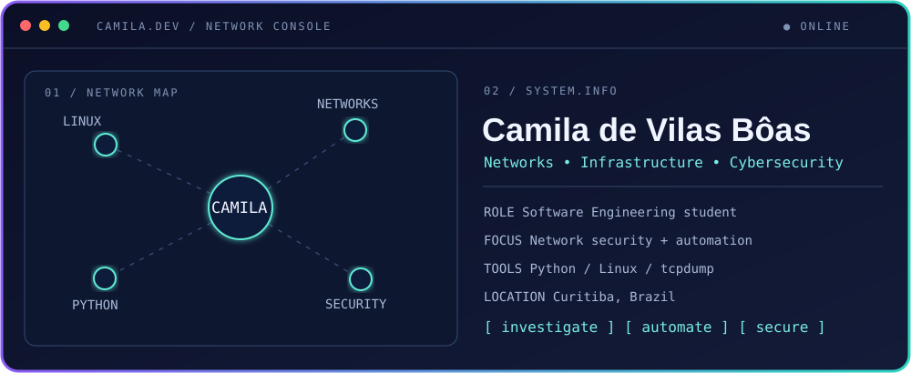

### Hi, I'm Camila 👋

Software Engineering student building a career in **networks, infrastructure and cybersecurity**.

---

### 👩‍💻 About me

I enjoy understanding how systems work behind the scenes, troubleshooting problems and automating repetitive tasks. I'm strengthening my foundation in **TCP/IP, Linux, IT support and Python** while developing practical cybersecurity skills.

- 🎓 Software Engineering student; degree in Systems Analysis and Development
- 🔎 Current focus: networking, infrastructure and security fundamentals
- 🐍 Building Python projects and exploring automation for IT operations
- 📍 Based in Curitiba, Brazil

### 🧰 Tools and topics

`Python` · `Linux` · `TCP/IP` · `DNS` · `tcpdump` · `Git` · `SQL` · `IT support`

### 📂 Projects

| Project | What you'll find |
| --- | --- |
| [DNS and ICMP traffic analysis](https://github.com/devilasboas/analise-trafego-dns-icmp-tcpdump) | Investigation of DNS queries and ICMP errors in a network incident using `tcpdump` logs. |
| [Intelligent Traffic Light](https://github.com/devilasboas/Semaforo-Inteligente) | A programming and logic exercise with a traffic light simulation. |
| [Rock, Paper, Scissors](https://github.com/devilasboas/Pedra-Papel-Tesoura) | A browser game built with HTML, CSS and JavaScript. |

### 🎯 What I'm working toward

Practical labs in network troubleshooting and security, Python automation for infrastructure, and a portfolio that documents what I learn and build.

---

Investigate • Automate • Secure

